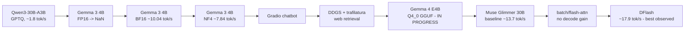

# Free GPU LLM Lab

[](LICENSE)
[](pyproject.toml)
[](https://github.com/piyushgargog/free-gpu-llm-lab/actions/workflows/ci.yml)

**How far can we push open-weight LLM inference using ₹0 / free GPU compute?**

A reproducible lab for running and optimizing **open-weight LLMs on
free-tier GPU platforms** (Google Colab, Kaggle). It documents real
experiments — what worked, what broke, and the actual measured numbers —
across **quantization** (FP16, BF16, NF4, GPTQ, GGUF), **llama.cpp + CUDA
multi-GPU inference**, **speculative decoding (DFlash)**, and a reusable
**LLM benchmarking** framework. No fabricated benchmarks: every result
here is either an **observed** measurement, or explicitly marked
**IN PROGRESS** / **NOT VERIFIED** / **INVALID**.

## Why This Exists

Free GPU tiers (Colab T4, Kaggle 2× T4) are a real, if constrained,
inference platform. This repo tracks how far that constraint can be pushed
— quantization strategy, multi-GPU splitting, speculative decoding — with
a hard rule: **document reality, not aspiration.**

## What's in this repo

- **Free-tier GPU inference experiments** on Google Colab and Kaggle,
  from a 30B MoE model down to a 4B dense model.
- **Quantization experiments**: FP16, BF16, NF4 (bitsandbytes), GPTQ, and
  GGUF (Q4_0, Q4_K_M) — with measured VRAM/speed tradeoffs, not
  theoretical ones. See `docs/quantization.md`.
- **llama.cpp CUDA builds and multi-GPU inference** on 2× Tesla T4,
  including the exact CMake configuration that worked after the default
  build failed.
- **Speculative decoding with DFlash** — including externally verified
  drafter architecture facts (`dflash.block_size`, valid
  `--spec-draft-n-max` range) kept clearly distinguished from our own
  measured benchmark numbers.
- **A reusable benchmark-recording framework** (`free_gpu_llm.benchmarking`)
  — append-only JSONL results, llama.cpp timing-output parsing, NaN/Inf
  logit validation.
- **A web-augmented Gradio chatbot** (DDGS search + trafilatura
  extraction) as external retrieval + prompt augmentation.
- **A lightweight, GPU-free local test suite + CI** — the core library
  imports GPU dependencies lazily, so it's fully testable without CUDA.

## Two environments — read before touching anything here

| | Personal PC | Remote GPU (Colab / Kaggle) |
|---|---|---|
| Code, docs, git | ✅ | |
| Lightweight tests (no GPU/model deps) | ✅ | |
| Download / load / run model weights | ❌ **never** | ✅ |

This PC never downloads, caches, loads, or runs LLM weights. Every script
that touches a model is marked `*** REMOTE GPU ONLY ***` and is meant to be
run in Colab/Kaggle. See `docs/colab.md`.

## Experiment Timeline



Full narrative with goal/config/result/root-cause/lesson per entry:
[`docs/experiments.md`](docs/experiments.md).

## Historical Experiments

- **[Qwen3-30B-A3B](experiments/qwen3-30b-a3b/README.md)** — GPTQ Int4
  MoE model, manual 2× T4 layer split after the GPTQ Marlin kernel proved
  incompatible with Turing. ~1.8 tok/s. Weights were lost after a Kaggle
  session restart; not currently reproducible.
- **[Gemma 3 4B](experiments/gemma3-4b/README.md)** — the FP16 NaN-logit
  failure, the BF16/NF4 valid baselines, and the original (non-web)
  Gradio chatbot.

## Benchmark Table

| Experiment | Hardware | Config | Generation tok/s | Status |
|---|---|---|---:|---|
| Qwen3-30B-A3B | 2× T4 | GPTQ Int4, backend=torch, manual layer split | ~1.8 | Historical, not reproducible (weights lost) |
| Gemma 3 4B | 1× T4 | FP16 | — | **INVALID — NaN logits** |
| Gemma 3 4B | 1× T4 | BF16, sdpa | ~10.04 | Valid |
| Gemma 3 4B | 1× T4 | NF4 (bitsandbytes) | ~7.84 | Valid |
| Gemma 4 E4B | 1× T4 | Q4_0 GGUF, llama.cpp CUDA | — | **IN PROGRESS — no benchmark yet** |
| Muse Glimmer 30B | 2× T4 | Q4_K_M GGUF, baseline | ~13.7 | Valid |
| Muse Glimmer 30B | 2× T4 | + batch 512 | ~13.6 | Valid, no decode improvement |
| Muse Glimmer 30B | 2× T4 | + Flash Attention | ~13.7 | Valid, no decode improvement |
| Muse Glimmer 30B | 2× T4 | **+ DFlash speculative decoding** (`--spec-draft-n-max 15`) | **~17.9** | **Best observed** (~30.7% over baseline) |
| Muse Glimmer 30B | 2× T4 | DFlash, `--spec-draft-n-max` ∈ {8,10,12,14,15} sweep | — | **NOT YET RUN** — harness ready |

**DFlash configuration fact (externally verified, not a benchmark
measurement):** the drafter's `dflash.block_size = 16`, which makes
`--spec-draft-n-max 15` (used above) the **maximum value** the
implementation accepts — not an arbitrary first guess. This says nothing
about whether 15 is the *fastest* value in that range; the sweep above
exists to answer exactly that and has not been run yet. Full detail:
[`experiments/muse-glimmer-30b/README.md`](experiments/muse-glimmer-30b/README.md).

Machine-readable versions live in each experiment's `results.jsonl`
(append-only, via `free_gpu_llm.benchmarking`).

## Hardware Constraints

- **Colab Free:** 1× Tesla T4, ~15 GB VRAM.
- **Kaggle Free:** 2× Tesla T4, ~15–16 GB VRAM each, no NVLink.
- Both are Turing-generation (compute capability 7.5) — several
  optimization paths that assume newer architectures (e.g. GPTQ Marlin)
  don't work here; see `docs/troubleshooting.md`.

## Architecture

See [`docs/architecture.md`](docs/architecture.md) for the full diagrams
(environment split, repo layers, benchmark data flow). Summary: a shared
`src/free_gpu_llm` library (lazy GPU-dependency imports, so it's
locally-testable) underneath per-experiment scripts in `experiments/`, a
Gradio app in `app/`, and utility scripts in `scripts/`.

## Quantization

FP16 / BF16 / NF4 / GPTQ / GGUF (Q4_0, Q4_K_M) as actually used in these
experiments, with the tradeoffs observed here — not universal claims. See
[`docs/quantization.md`](docs/quantization.md).

## Reproduction

```bash
# Local (safe — no GPU/model deps required)
pip install -e ".[dev]"
python -m compileall src experiments scripts
pytest tests/

# Remote GPU (Colab/Kaggle) — see docs/colab.md for full walkthrough
python scripts/check_environment.py
python experiments/gemma3-4b/benchmark.py --dtype bf16
python experiments/muse-glimmer-30b/benchmark.py --binary <llama-cli> --model <gguf> --notes baseline
```

## Colab / Kaggle

Full setup walkthrough (GPU runtime, HF auth, dependency install, model
download, llama.cpp CUDA build, DFlash): [`docs/colab.md`](docs/colab.md).

## Gradio

- `experiments/gemma3-4b/gradio_app.py` — plain chatbot, no web access,
  model loaded once at startup, fixed system prompt.
- `app/gradio_app.py` — web-augmented version (see below).

## Web Retrieval

DDGS search + trafilatura extraction, keyword-triggered, injected into the
prompt as context. **External retrieval + prompt augmentation — not
autonomous browsing, not native tool-calling.** Architecture, trigger
keywords, and failure handling: [`docs/web-retrieval.md`](docs/web-retrieval.md).

## Gemma 4

Q4_0 GGUF identified as the right fit for a free T4 (native BF16 is ~16 GB,
too large). CUDA build path for `llama-cpp-python` established
(`llama_supports_gpu_offload()`). **No completed benchmark exists yet** —
see `experiments/gemma4-e4b/README.md`.

## Muse Glimmer

The latest and best-optimized experiment: a ~28B Q4_K_M GGUF model running
on 2× Kaggle T4 via a from-source llama.cpp CUDA build. Full model
metadata, build config, and per-optimization results:
[`experiments/muse-glimmer-30b/README.md`](experiments/muse-glimmer-30b/README.md).
Source-level research into further optimization candidates (CUDA graphs,
multi-GPU split modes, kernel tuning), all clearly marked `NOT TESTED`:
[`experiments/muse-glimmer-30b/optimization-research.md`](experiments/muse-glimmer-30b/optimization-research.md).

## DFlash

Speculative decoding using a small "DFlash" drafter model verified against
Muse Glimmer's full model. **Current best observed Muse configuration:
~17.9 tok/s, ~30.7% over the ~13.7 tok/s no-speculative-decoding baseline,
using `--spec-draft-n-max 15`.** The drafter's `dflash.block_size = 16` is
externally verified, making 15 the maximum valid value for that flag —
**not** a claim that it's the fastest one; a draft-length sweep over
`{8, 10, 12, 14, 15}` is prepared but not yet run. Batch size and Flash
Attention were also tried and did **not** improve decode throughput —
DFlash is the only lever that has, so far. See
`experiments/muse-glimmer-30b/optimize.md` for the controlled-optimization
methodology and what's still untested.

## Troubleshooting

Real issues hit and how they were resolved (GPTQ Marlin on T4, FP16 NaN
logits, GQA attention-kernel compatibility, CPU-only llama-cpp-python,
CMake `CUDA::cuda_driver` build failure, the DFlash `ctx_other` startup
warning): [`docs/troubleshooting.md`](docs/troubleshooting.md).

## Lessons Learned

- GPTQ Marlin is not guaranteed to work on Turing (T4) — `backend="torch"`
  is a slower but working fallback.
- A model "generating text" is not proof of numerical correctness — always
  validate logits for NaN/Inf before trusting a benchmark.
- Kernel/config knobs that intuitively "should" help (larger batch size,
  Flash Attention) don't always move single-stream decode throughput —
  measure, don't assume.
- Speculative decoding (DFlash) was the first lever in the Muse experiments
  that produced a real decode-speed improvement, because it changes *how
  many forward passes* are needed per output token, not just how fast each
  one runs.
- Knowing a configuration's valid *range* (e.g. the maximum valid
  `--spec-draft-n-max`) is a different fact from knowing its
  *fastest-performing* value — don't conflate the two.

## Limitations

- Several results are single-run observations, not averaged over multiple
  trials.
- Qwen3-30B-A3B is not currently reproducible (weights lost after a Kaggle
  session restart).
- Gemma 4 E4B has no completed benchmark.
- Muse Glimmer's DFlash configuration has no measured prompt-eval tok/s,
  and the `{8,10,12,14,15}` draft-length sweep has not been run.
- No results here should be assumed to generalize beyond the specific
  model/quantization/hardware/prompt-length combination measured.

## Future Work

- Complete a Gemma 4 E4B CUDA benchmark.
- Re-download Qwen3-30B-A3B and re-verify the manual-split loading code in
  `experiments/qwen3-30b-a3b/run.py` (currently NOT VERIFIED).
- Run the prepared DFlash draft-length sweep (`{8,10,12,14,15}`) and
  verify the best-performing value with a second identical run.
- Work through the untested Muse optimization candidates in
  `experiments/muse-glimmer-30b/optimize.md` and
  `experiments/muse-glimmer-30b/optimization-research.md` (CUDA graph
  toggling, multi-GPU split mode, KV cache config, etc.) — one controlled
  variable at a time, against the 17.9 tok/s DFlash baseline.
- Replace the web-retrieval keyword heuristic with real model tool-calling.

## Repository Layout

```
free-gpu-llm-lab/
├── experiments/        one folder per model/config, with its own README + results.jsonl
├── src/free_gpu_llm/   shared library (lazy GPU-dependency imports)
├── app/                web-augmented Gradio chatbot
├── scripts/            environment/GPU checks, benchmark recorder, guarded model downloader
├── tests/              lightweight, local, no GPU/model deps
├── docs/               architecture, experiment log, quantization, troubleshooting, etc.
├── .github/workflows/  CI: compile checks + unit tests only (no GPU, no model weights)
└── notebooks/          (empty — experiments are tracked as scripts, not notebooks)
```

## Safety

This repo enforces a strict split between local development and remote GPU
execution — see the table at the top of this README and `docs/colab.md`.
`.gitignore` excludes model weights, caches, and secrets; `.env.example`
documents the only expected secret (`HF_TOKEN`), which is never committed.

## License

[MIT](LICENSE).
