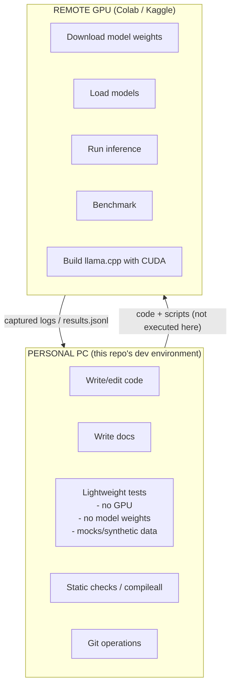
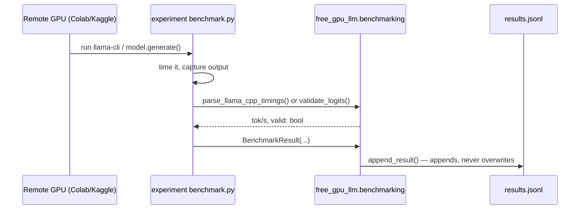
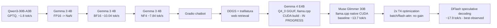

# Architecture

## Two environments — never mix them



The personal PC **never** downloads, caches, loads, or runs LLM weights.
Every script under `experiments/*/run.py`, `experiments/*/benchmark.py`,
`app/gradio_app.py`, and `scripts/download_model.py` is written to be
executed remotely — see the `*** REMOTE GPU ONLY ***` banner at the top of
each such file.

## Repository layers

```mermaid
flowchart TB
    subgraph experiments["experiments/<name>/"]
        E1[README.md - what happened, real numbers]
        E2[run.py / benchmark.py - remote-only scripts]
        E3[results.jsonl - append-only benchmark records]
    end

    subgraph src["src/free_gpu_llm/"]
        S1[config.py - dataclasses, env loading]
        S2[hardware.py - GPU detection]
        S3[generation.py - chat history, logit validation,\nmodel load/generate (lazy torch import)]
        S4[benchmarking.py - BenchmarkResult, JSONL I/O,\nllama.cpp output parsing]
        S5[web/ - search, extract, retrieval, pipeline]
    end

    subgraph apps["app/, scripts/"]
        A1[app/gradio_app.py - web-augmented chatbot]
        A2[scripts/check_environment.py, check_gpu.py]
        A3[scripts/benchmark.py, download_model.py]
    end

    experiments --> src
    apps --> src
```

`src/free_gpu_llm` is the shared library. Every module that could require a
GPU or model weights (`generation.load_model_and_tokenizer`, `generate`,
`web.search.search`, `web.extract.extract_text`) imports its heavy
dependency **lazily, inside the function**, specifically so that:

1. The package imports cleanly on a machine with no `torch`/`transformers`/
   `llama_cpp`/`gradio`/`ddgs`/`trafilatura` installed.
2. `tests/` can exercise the pure-logic parts (history normalization, NaN/Inf
   checks, URL dedup, tok/s math, llama.cpp log parsing) without a GPU.

## Benchmark data flow



Each `results.jsonl` is append-only (`free_gpu_llm.benchmarking.append_result`)
specifically so the historical record — including invalid/failed runs — is
preserved, not silently replaced by the latest run.

## Experiment timeline


