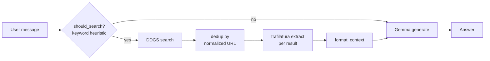

# Web Retrieval Architecture

## What this is (and isn't)

The web-augmented chatbot (`app/gradio_app.py`) adds external web search +
page-text extraction as a preprocessing step before the model generates a
response. This is **external retrieval + prompt augmentation**.

It is explicitly **not**:
- autonomous browsing (the model never navigates or clicks anything)
- native model tool-calling (the model never decides to invoke a tool call
  in its own output format — a keyword heuristic decides for it)

It's kept modular specifically so the keyword-heuristic trigger can later
be replaced by real tool calling (the model deciding, in its own output,
when to search) without touching the retrieval/extraction code underneath.

## Architecture



## Modules (`src/free_gpu_llm/web/`)

- **`search.py`** — `search(query, max_results)` wraps `ddgs.DDGS().text()`.
  Has a timeout, catches all exceptions (returns `[]` on failure — a failed
  search never crashes the chatbot), and dedupes by `normalize_url()`
  before truncating to `max_results`.
- **`extract.py`** — `extract_text(url)` wraps `trafilatura.fetch_url` +
  `trafilatura.extract`. Returns `None` on any failure (network error,
  empty page, extraction yielding nothing) instead of raising.
  `truncate_text()` caps extracted text length, breaking on a word boundary
  and marking `[...truncated]` explicitly rather than silently cutting text.
- **`retrieval.py`** — `retrieve(query)` runs search → extract for each
  result, skipping pages that fail extraction (not raising), and
  `format_context(documents)` renders the retrieved documents into a
  numbered context block for the prompt.
- **`pipeline.py`** — `should_search(message)`: a keyword-substring
  heuristic (see `SEARCH_TRIGGER_KEYWORDS`) deciding whether a message
  looks like it needs fresh information. `build_augmented_context(message)`
  ties the above together: returns `""` (no augmentation) if `should_search`
  is false or retrieval fails/returns nothing.

## Search trigger keywords

```
latest, recent, today, yesterday, tomorrow, current, now, news, price,
stock, weather, score, results, update, updates, 2026, 2025, who is,
what happened, search, look up, find, according to
```

This is a substring match on the lowercased message — a heuristic, not a
classifier. It will have false positives (e.g. "the latest Python syntax"
triggers a search even though it may not need one) and false negatives
(a time-sensitive question phrased without any of these words won't
trigger). This is documented behavior, not a bug to silently work around.

## Failure handling

- Empty search results → `retrieve()` returns `[]`, `format_context([])`
  returns `""`, generation proceeds with no augmentation.
- A single page failing to fetch/extract → that page is skipped; other
  pages in the same batch are unaffected.
- Any exception inside `search()` or `extract_text()` is caught and logged
  (never a bare `except: pass`), and the function returns its documented
  "nothing found" value (`[]` or `None`) rather than propagating.

## Where this could go next

Swapping the `should_search` keyword heuristic for real tool-calling (the
model emitting a structured "call search(query)" in its own output, per
its chat template's tool-calling support) is the natural next step —
`retrieval.py`/`search.py`/`extract.py` would not need to change, only the
trigger/orchestration layer in `pipeline.py`.
